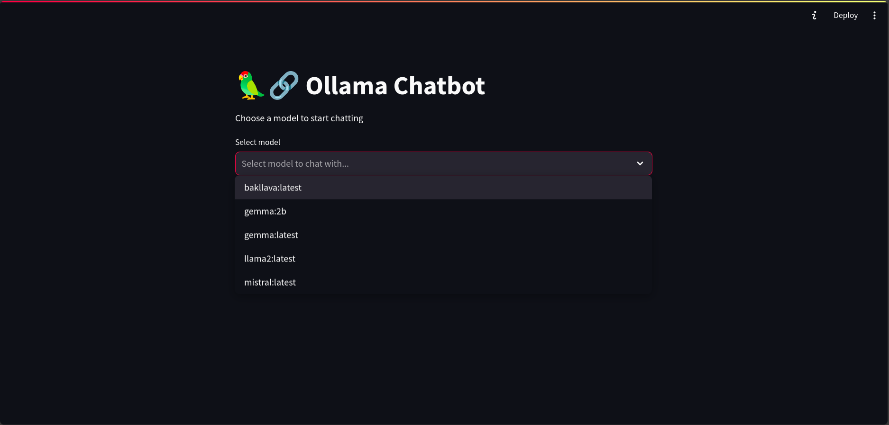

# OllamaChat - A Streamlit Chatbot

## Description

OllamaChat is a chatbot application built with Python, using the Ollama and LangChain libraries. It allows users to interact with different chatbot models, which can be selected from a dropdown menu.

## Note

These models tend to hallucinate :D
Any improvements or fixes are welcome

## Installation

Before running the application, you need to install the necessary Python libraries. You can do this by running the following command:

1. Download Ollama from [here](https://github.com/ollama/ollama) and download the models you want using the instructions in the README file.

2. Install the required Python libraries using the following command:

```bash
pip install -r requirements.txt
```

## Usage

To run the application, use the following command:

```bash
streamlit run OllamaChat.py
```

or

```bash
python -m streamlit run OllamaChat.py
```

## Screenshots

The following screenshots show the application in action:

1. Selecting the model to use
   

2. Chatting with the chatbot
   

## Future Work

1. Add in option to ingest PDFs and chat with PDFs
2. Add in option to chat with images
3. Optimisations and making the code cleaner
4. Squashing bugs
